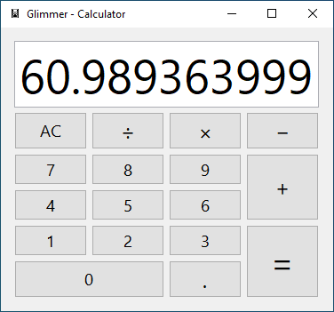
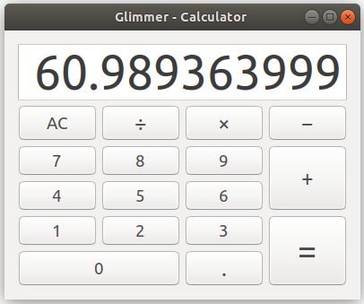
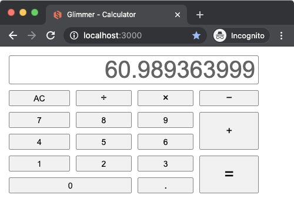
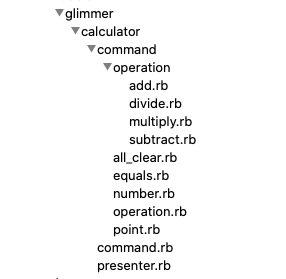
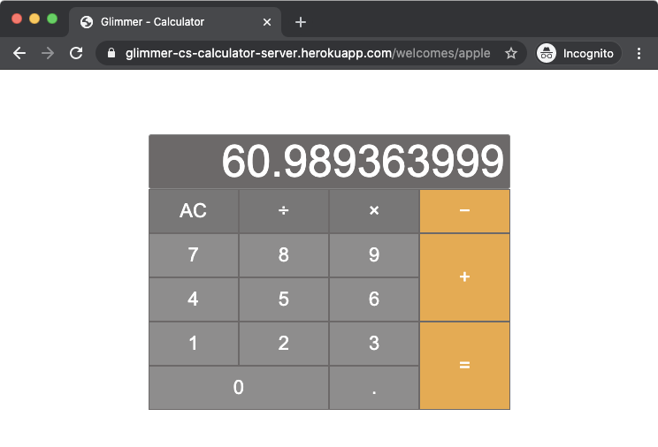
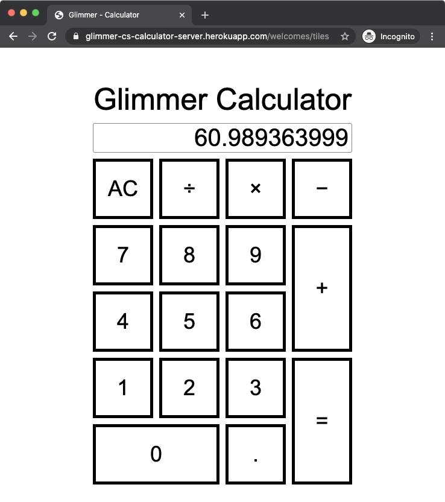

#  Glimmer Calculator
## [ Glimmer Custom Shell](https://github.com/AndyObtiva/glimmer-dsl-swt#custom-shell-gem)
[](http://badge.fury.io/rb/glimmer-cs-calculator)

Glimmer Calculator on Mac


Glimmer Calculator on Windows



Glimmer Calculator on Linux



Glimmer Calculator on [Opal](#glimmer-dsl-for-opal) (Web)

[](http://glimmer-cs-calculator-server.herokuapp.com)

Glimmer Calculator is a sample desktop GUI application built with [Glimmer DSL for SWT](https://github.com/AndyObtiva/glimmer-dsl-swt) (JRuby Desktop Development GUI Library).

Architectural Pattern is MVP (Model View Presenter) thanks to [Glimmer data-binding](https://github.com/AndyObtiva/glimmer-dsl-swt#data-binding) support.

Glimmer Calculator was developed test-first following TDD (Test Driven Development) after [Glimmer Scaffolding](https://github.com/AndyObtiva/glimmer-dsl-swt#scaffolding).

Design Patterns discovered in the process were Facade (Presenter) and Command Pattern.

Here are the calculator commands under the [models directory](lib/models/glimmer/calculator):



[Download Glimmer Calculator v1.1.1 DMG for Mac](https://www.dropbox.com/s/2wbyy0z0w875n39/Glimmer%20Calculator-1.1.1.dmg?dl=1)

[Download Glimmer Calculator v1.1.1 MSI for Windows](https://www.dropbox.com/s/e8b586s2xgjn9bg/Glimmer%20Calculator-1.1.1.msi?dl=1)

[Download Glimmer Calculator v1.1.4 GEM for Linux](#setup-instructions)

[Visit Glimmer Calculator v1.1.2 WEB for Opal](https://glimmer-cs-calculator-server.herokuapp.com)

## Platforms

- Mac: Tested and [packaged](https://github.com/AndyObtiva/glimmer-dsl-swt#packaging--distribution) for Mac. ([Download Here](https://www.dropbox.com/s/2wbyy0z0w875n39/Glimmer%20Calculator-1.1.1.dmg?dl=1))
- Windows: Tested and [packaged](https://github.com/AndyObtiva/glimmer-dsl-swt#packaging--distribution) for Windows. ([Download Here](https://www.dropbox.com/s/e8b586s2xgjn9bg/Glimmer%20Calculator-1.1.1.msi?dl=1))
- Linux: Tested and [packaged](http://rubygems.org/gems/glimmer-cs-calculator) for Linux (Follow [setup instructions](#setup-instructions) to install [gem](http://rubygems.org/gems/glimmer-cs-calculator) and run `calculator` command)
- Opal (Web): Tested with [Glimmer DSL for Opal](https://github.com/AndyObtiva/glimmer-dsl-opal) and [deployed to Heroku](https://glimmer-cs-calculator-server.herokuapp.com). Visit https://glimmer-cs-calculator-server.herokuapp.com

## Development Environment Pre-requisites

- JRuby 9.2.11.1 (supporting Ruby 2.5.x syntax) (find at https://www.jruby.org/download)
- Java SE Runtime Environment 7 or higher (find at https://www.oracle.com/java/technologies/javase-downloads.html)

## Setup Instructions

### Glimmer DSL for SWT

Install Calculator gem by running (`jgem`, `jruby -S gem`, or `gem` directly if you have RVM):

```
jgem install glimmer-cs-calculator
```

Afterwards, you may run `calculator` to bring up the calculator:

```
calculator
```

Note: If you cloned this project and bundle installed, you may invoke via `bin/calculator` instead.

#### Glimmer Custom Shell Reuse

To reuse Calculator as a Glimmer Custom Shell inside another Glimmer application, add the
following to the application's `Gemfile`:

```
gem 'glimmer-cs-calculator', '1.1.4'
```

Run:

```
jruby -S bundle
```

And, then instantiate the Calculator custom shell in your Glimmer application via the `calculator` Glimmer DSL keyword.

### Glimmer DSL for Opal

The app Rails server lives under: [server/glimmer-cs-calculator-server](server/glimmer-cs-calculator-server)

It is deployed to Heroku at: https://glimmer-cs-calculator-server.herokuapp.com

[Setup instructions](https://github.com/AndyObtiva/glimmer-dsl-opal#setup) from [Glimmer DSL for Opal](https://github.com/AndyObtiva/glimmer-dsl-opal) were followed in creating the Rails server.

This is the content of `app/assets/javascripts/application.rb`:

```ruby
require 'glimmer-dsl-opal'

Document.ready? do
  require 'glimmer-cs-calculator/launch'
end
```

As you can see, Glimmer Calculator works as is by adding one require statement without needing to change a single line of its code thanks to [Glimmer DSL for Opal](https://github.com/AndyObtiva/glimmer-dsl-opal).

[](http://glimmer-cs-calculator-server.herokuapp.com)

#### CSS Themes

CSS can be applied externally in Rails onto any Rails Route serving an Opal app.

##### Apple Calculator CSS Theme

Visit: http://glimmer-cs-calculator-server.herokuapp.com/welcomes/apple

[server/glimmer-cs-calculator-server/app/assets/stylesheets/welcomes_apple.scss](server/glimmer-cs-calculator-server/app/assets/stylesheets/welcomes_apple.scss)

[](http://glimmer-cs-calculator-server.herokuapp.com/welcomes/apple)

##### Tiles CSS Theme

Visit: http://glimmer-cs-calculator-server.herokuapp.com/welcomes/tiles

[server/glimmer-cs-calculator-server/app/assets/stylesheets/welcomes_tiles.scss](server/glimmer-cs-calculator-server/app/assets/stylesheets/welcomes_tiles.scss)

[](http://glimmer-cs-calculator-server.herokuapp.com/welcomes/tiles)

## Feature Suggestions

[TODO.md](TODO.md)

## Change Log

[CHANGELOG.md](CHANGELOG.md)

## Contributing to glimmer-cs-calculator
 
* Check out the latest master to make sure the feature hasn't been implemented or the bug hasn't been fixed yet.
* Check out the issue tracker to make sure someone already hasn't requested it and/or contributed it.
* Fork the project.
* Start a feature/bugfix branch.
* Commit and push until you are happy with your contribution.
* Make sure to add tests for it. This is important so I don't break it in a future version unintentionally.
* Please try not to mess with the Rakefile, version, or history. If you want to have your own version, or is otherwise necessary, that is fine, but please isolate to its own commit so I can cherry-pick around it.

## Copyright

[MIT](https://opensource.org/licenses/MIT)

Copyright (c) 2020 Andy Maleh. See [LICENSE.txt](LICENSE.txt) for further details.

--

[](https://github.com/AndyObtiva/glimmer) Built with [Glimmer DSL for SWT](https://github.com/AndyObtiva/glimmer-dsl-swt) (JRuby Desktop Development GUI Library)

Glimmer Calculator icon made by <a href="https://www.flaticon.com/authors/freepik" title="Freepik">Freepik</a> from <a href="https://www.flaticon.com/" title="Flaticon">www.flaticon.com</a>
