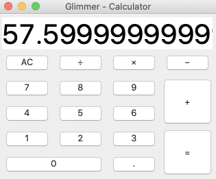

# Calculator - Glimmer Custom Shell
[](http://badge.fury.io/rb/glimmer-cs-calculator)



Calculator sample desktop GUI application built with Glimmer (Ruby Desktop Development Library).

## Platforms

- Mac: Calculator works best on the Mac.
- Linux: Calculator works with handicaps on Linux (performing text editing operations causes scroll jitter)
- Windows: Not tested on Windows yet, but should theoretically work there too.

## Pre-requisites

- JRuby 9.2.11.1 (supporting Ruby 2.5.x syntax) (find at https://www.jruby.org/download)
- Java SE Runtime Environment 7 or higher (find at https://www.oracle.com/java/technologies/javase-downloads.html)

## Setup Instructions

Install Calculator gem by running (`jgem`, `jruby -S gem`, or `gem` directly if you have RVM):

```
jgem install glimmer-cs-calculator
```

Afterwards, you may run `calculator` to bring up the text editor:

```
calculator
```

Note: If you cloned this project and bundle installed, you may invoke via `bin/calculator` instead. 

### Glimmer Custom Shell Reuse

To reuse Calculator as a Glimmer Custom Shell inside another Glimmer application, add the 
following to the application's `Gemfile`:

```
gem 'glimmer-cs-calculator', '0.1.6'
```

Run:

```
jruby -S bundle
```

And, then instantiate the Calculator custom shell in your Glimmer application via the `calculator` keyword.

## Contributing to glimmer-cs-calculator
 
* Check out the latest master to make sure the feature hasn't been implemented or the bug hasn't been fixed yet.
* Check out the issue tracker to make sure someone already hasn't requested it and/or contributed it.
* Fork the project.
* Start a feature/bugfix branch.
* Commit and push until you are happy with your contribution.
* Make sure to add tests for it. This is important so I don't break it in a future version unintentionally.
* Please try not to mess with the Rakefile, version, or history. If you want to have your own version, or is otherwise necessary, that is fine, but please isolate to its own commit so I can cherry-pick around it.

## Copyright

Copyright (c) 2020 Andy Maleh. See LICENSE.txt for
further details.
