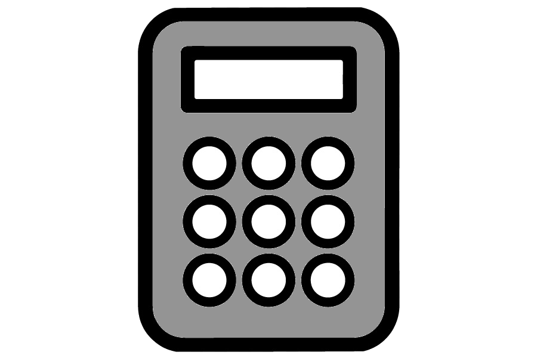
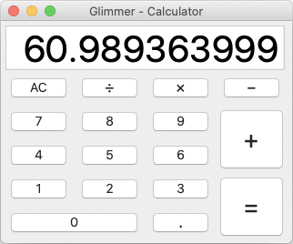

#  Glimmer Calculator
## [ Glimmer Custom Shell](https://github.com/AndyObtiva/glimmer#custom-shell-gem)
[](http://badge.fury.io/rb/glimmer-cs-calculator)



Glimmer Calculator is a sample desktop GUI application built with [Glimmer](https://github.com/AndyObtiva/glimmer) (Ruby Desktop Development Library).

It is developed test-first following TDD (Test Driven Development). 
Design Patterns discovered in the process were Presenter/Facade and Command Pattern.

Follows the MVP architectural pattern (Model View Presenter) thanks to [Glimmer data-binding](https://github.com/AndyObtiva/glimmer#data-binding) support.

[Download Glimmer Calculator v1.0.2 for the Mac](https://www.dropbox.com/s/3fwq5cpetr99f45/Glimmer%20Calculator-1.0.2.dmg?dl=1)

## Platforms

- Mac: Tested and [packaged](https://github.com/AndyObtiva/glimmer#packaging--distribution) for the Mac. ([Download Here](https://www.dropbox.com/s/3fwq5cpetr99f45/Glimmer%20Calculator-1.0.2.dmg?dl=1))
- Linux: Not tested/packaged for Linux, but should work by following setup instructions below.
- Windows: Not tested/packaged for Windows, but should work by following setup instructions below.

## Development Environment Pre-requisites

- JRuby 9.2.11.1 (supporting Ruby 2.5.x syntax) (find at https://www.jruby.org/download)
- Java SE Runtime Environment 7 or higher (find at https://www.oracle.com/java/technologies/javase-downloads.html)

## Setup Instructions

Install Calculator gem by running (`jgem`, `jruby -S gem`, or `gem` directly if you have RVM):

```
jgem install glimmer-cs-calculator
```

Afterwards, you may run `calculator` to bring up the calculator:

```
calculator
```

Note: If you cloned this project and bundle installed, you may invoke via `bin/calculator` instead. 

### Glimmer Custom Shell Reuse

To reuse Calculator as a Glimmer Custom Shell inside another Glimmer application, add the 
following to the application's `Gemfile`:

```
gem 'glimmer-cs-calculator', '1.0.2'
```

Run:

```
jruby -S bundle
```

And, then instantiate the Calculator custom shell in your Glimmer application via the `calculator` Glimmer DSL keyword.

## Change Log

- 1.0.2: Relaxed dependency on glimmer-dsl-swt (>= 0.1.1 < 2.0.0) / updated logo / used new Glimmer `message_box` keyword syntax
- 1.0.1: Upgraded to glimmer-dsl-swt v0.1.1 / added delete/backspace shortcut for AC / fixed issues with pressing operations without any number
- 1.0.0: Initial calculator implementation

## Contributing to glimmer-cs-calculator
 
* Check out the latest master to make sure the feature hasn't been implemented or the bug hasn't been fixed yet.
* Check out the issue tracker to make sure someone already hasn't requested it and/or contributed it.
* Fork the project.
* Start a feature/bugfix branch.
* Commit and push until you are happy with your contribution.
* Make sure to add tests for it. This is important so I don't break it in a future version unintentionally.
* Please try not to mess with the Rakefile, version, or history. If you want to have your own version, or is otherwise necessary, that is fine, but please isolate to its own commit so I can cherry-pick around it.

## Copyright

[MIT](https://opensource.org/licenses/MIT)

Copyright (c) 2020 Andy Maleh. See [LICENSE.txt](LICENSE.txt) for further details.

--

[](https://github.com/AndyObtiva/glimmer) Built with [Glimmer](https://github.com/AndyObtiva/glimmer) (Ruby Desktop Development GUI Library)
